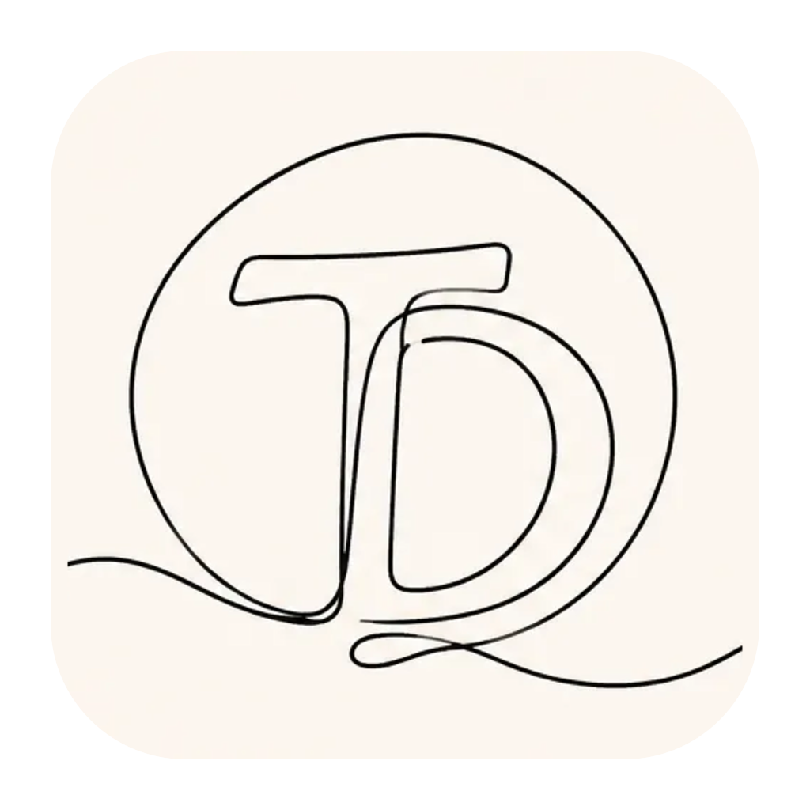

<p align="center">
  
</p>

<h1 align="center">True Drawing</h1>

<p align="center">
  <strong>IT</strong> - App desktop locale per trasformare uno schizzo disegnato dall'utente in un'immagine generata con AI.<br />
  <strong>EN</strong> - Local desktop app that turns a user-drawn sketch into an AI-generated image.
</p>

<p align="center">
  
  
  
  
  
</p>

## Scheda rapida / Quick facts

| IT | EN |
| --- | --- |
| Versione sorgente: `0.8.2` | Source version: `0.8.2` |
| Stato: alpha funzionante | Status: working alpha |
| Piattaforme: macOS e Windows | Platforms: macOS and Windows |
| Runtime desktop: Electron | Desktop runtime: Electron |
| UI: React, TypeScript, Vite | UI: React, TypeScript, Vite |
| Canvas: HTML Canvas 2D con Pointer Events | Canvas: HTML Canvas 2D with Pointer Events |
| AI: OpenAI Images API configurata dall'utente | AI: user-configured OpenAI Images API |
| Segreti: Windows Credential Manager, macOS Keychain o fallback cifrato | Secrets: Windows Credential Manager, macOS Keychain, or encrypted fallback |
| Packaging: electron-builder, NSIS Windows, DMG/ZIP macOS | Packaging: electron-builder, Windows NSIS, macOS DMG/ZIP |
| Release: artifact GitHub non firmati | Releases: unsigned GitHub artifacts |
| Licenza dichiarata: Apache 2.0 | Declared license: Apache 2.0 |

## Riferimenti tecnici / Technical references

- Repository: `https://github.com/gloutchov/truedrawing`
- App ID: `com.truedrawing.app`
- Package name: `truedrawing`
- Entry point Electron: `dist-electron/main/appMain.js`
- Configurazione app / app config: `config/app.config.json`
- Packaging config: `electron-builder.yml`
- Roadmap: `PLAN.md`
- Architettura / architecture map: `MAP.md`
- Sicurezza / security model: `SECURITY_MODEL.md`
- Istruzioni utente IT: `ISTRUZIONI.md`
- User instructions EN: `INSTRUCTIONS.md`

## Comandi principali / Main commands

```bash
npm ci --no-audit --no-fund
npm run dev
npm run lint
npm run test
npm run build
npm run dist:win
npm run dist:mac
```

> IT: le build Windows/macOS pubblicate su GitHub non sono firmate perche' non sono disponibili certificati di firma o notarizzazione. Windows SmartScreen e macOS Gatekeeper possono mostrare avvisi al primo avvio.
>
> EN: Windows/macOS builds published on GitHub are unsigned because signing or notarization credentials are not available. Windows SmartScreen and macOS Gatekeeper may show warnings on first launch.

## Italiano

True Drawing e' un'app desktop locale per macOS e Windows pensata per disegnare con mouse, tavoletta grafica tipo Wacom o input compatibili con Pointer Events. L'obiettivo e' permettere all'utente di creare un disegno su canvas e generare una versione realistica tramite API configurata dall'utente.

Il progetto e' in fase iniziale. La versione corrente e' `0.8.2` e contiene lo skeleton desktop Electron/Vite/React, struttura modulare, configurazione centrale validata, canvas interattivo con Pointer Events, strumenti di tratto/linea/shape/riempimento, layer, inspector realistico con generazione OpenAI, gestione API key tramite keychain/credential manager, preferenze modello/stile immagine e redraw automatico, preferenze lingua/tema interfaccia, hardening Electron con CSP, salvataggio manuale, autosave, recupero, export PNG/WebP e rifiniture UX con status bar, stati vuoti, conferme distruttive e zoom persistente.

Repository privato GitHub: `https://github.com/gloutchov/truedrawing`.

### Distribuzione

Le release GitHub per Windows e macOS sono distribuite senza firma codice e senza notarizzazione perche' non sono disponibili certificati o credenziali di firma. Windows SmartScreen e macOS Gatekeeper possono quindi mostrare avvisi di sicurezza all'apertura dell'app scaricata.

### Funzionalita' previste

- App desktop Electron avviabile con finestra principale True Drawing.
- Canvas pulito per disegno libero con input mouse, penna e touch compatibile.
- Strumenti per matita, pennarello, pennello e gomma.
- Sottomenù per linea retta/curva, shape rettangolo/ellisse/triangolo/poligono e tipo tratto continuo/tratteggiato/a puntini.
- Strumento riempimento delimitato dai confini gia' disegnati nel layer.
- Strumento selezione rettangolare per cut/copy/paste sul canvas, anche con `Ctrl/Cmd+X/C/V`.
- Oggetto incollato spostabile finche' resta selezionato.
- Controllo colore, dimensione tratto, opacita' e hardness.
- Zoom canvas con pulsanti `+`/`-`, reset e rotella del mouse.
- Status bar con stato salvataggio, modifiche, tool, layer attivo, conteggio layer/tratti e zoom.
- Pulsante visibile per uscire dal fullscreen quando la finestra e' a schermo intero.
- Layer con creazione, rinomina, cancellazione protetta, visibilita', opacita' e riordino.
- Conferme per azioni rischiose come chiusura con modifiche non salvate, eliminazione layer, rimozione API key e scarto autosave.
- Undo e redo per tratti disegnati e operazioni layer.
- Inspector per generare e mostrare l'immagine realistica dal canvas, con stati chiari per immagine assente, generazione, errore e API key mancante.
- Menu per inserire, sostituire o rimuovere la API key OpenAI e scrivere il modello immagini.
- Menu per scegliere uno stile immagine predefinito o personalizzato.
- Menu per attivare redraw automatico dell'inspector dopo un tempo di inattivita' configurabile.
- Menu `File > Impostazioni > Interfaccia...` per scegliere lingua italiana/inglese e tema chiaro/scuro, con opzione default di sistema.
- Doppio click sull'inspector per passare fra immagine realistica e canvas.
- Autosave e salvataggio manuale di canvas e immagine.
- Salvataggio progetto `.tdraw`, sidecar `<nome>_canvas` e `<nome>_image`, recupero autosave ed export PNG/WebP.
- Gestione API key tramite Windows Credential Manager, macOS Keychain o fallback locale cifrato per ambienti non supportati.
- Modello immagini configurabile dall'utente come testo libero, con default OpenAI `gpt-image-1.5`.
- Stili immagine predefiniti in ordine alfabetico: acquerello, cartoon, infantile, olio, realistica, surreale.

### Documenti principali

- `PLAN.md`: piano milestone, versioni e verifiche.
- `AGENTS.md`: direttive operative per lo sviluppo.
- `MAP.md`: mappa ASCII della struttura del programma.
- `ISTRUZIONI.md`: istruzioni utente in italiano.
- `INSTRUCTION.md`: istruzioni utente in inglese.
- `SECURITY_MODEL.md`: modello di sicurezza in italiano e inglese.
- `config/app.config.json`: parametri modificabili da utenti skilled e sviluppatori.

### Sviluppo locale

Requisiti:

- Node.js 22.
- npm.

Comandi:

- `npm ci --no-audit --no-fund`
- `npm run dev`
- `npm run lint`
- `npm run test`
- `npm run build`
- `npm run dist:win`
- `npm run dist:mac`

## English

True Drawing is a local desktop app for macOS and Windows designed for drawing with a mouse, a graphics tablet such as Wacom, or input devices exposed through Pointer Events. The goal is to let users create a canvas drawing and generate a realistic image from it through a user-configured API.

The project is at its initial stage. Current version is `0.8.2` and includes the Electron/Vite/React desktop skeleton, modular structure, validated central configuration, interactive canvas with Pointer Events, stroke/line/shape/fill tools, layers, realistic inspector with OpenAI image generation, API key storage through keychain/credential manager, image model/style and auto-redraw preferences, interface language/theme preferences, Electron hardening with CSP, manual save, autosave, recovery, PNG/WebP export, and UX polish with a status bar, empty states, destructive-action confirmations, and persistent zoom.

Private GitHub repository: `https://github.com/gloutchov/truedrawing`.

### Distribution

GitHub releases for Windows and macOS are distributed without code signing and without notarization because signing certificates or credentials are not available. Windows SmartScreen and macOS Gatekeeper may therefore show security warnings when opening the downloaded app.

### Planned Features

- Runnable Electron desktop app with a True Drawing main window.
- Clean freehand drawing canvas with mouse, pen, and compatible touch input.
- Pencil, marker, brush, and eraser tools.
- Submenus for straight/curved line, rectangle/ellipse/triangle/polygon shape, and solid/dashed/dotted stroke style.
- Fill tool bounded by already drawn layer edges.
- Rectangular selection tool for canvas cut/copy/paste, including `Ctrl/Cmd+X/C/V`.
- Pasted object can be moved while it remains selected.
- Color, stroke size, opacity, and hardness controls.
- Canvas zoom with `+`/`-` buttons, reset, and mouse wheel.
- Status bar with save state, dirty state, active tool, active layer, layer/stroke counts, and zoom.
- Visible fullscreen exit button while the window is fullscreen.
- Layer creation, renaming, protected deletion, visibility, opacity, and ordering.
- Confirmations for risky actions such as closing with unsaved changes, layer deletion, API key removal, and autosave discard.
- Undo and redo for drawn strokes and layer operations.
- Inspector for realistic image generation and preview from the canvas, with clear states for missing image, generation, errors, and missing API key.
- Menu entry to enter, replace, or remove the OpenAI API key and type the image model.
- Menu entry to choose a predefined or custom image style.
- Menu entry to enable inspector auto-redraw after a configurable idle delay.
- `File > Settings > Interface...` menu entry to choose Italian/English and light/dark theme, including system-default options.
- Double click on the inspector to switch between realistic image and drawing canvas.
- Autosave and manual save for both canvas and generated image.
- `.tdraw` project saving, `<name>_canvas` and `<name>_image` sidecars, autosave recovery, and PNG/WebP export.
- API key management through Windows Credential Manager, macOS Keychain, or encrypted local fallback for unsupported environments.
- User-configurable image model as free text, defaulting to OpenAI `gpt-image-1.5`.
- Predefined image styles in alphabetical order: acquerello, cartoon, infantile, olio, realistica, surreale.

### Main Documents

- `PLAN.md`: milestone plan, versions, and verification rules.
- `AGENTS.md`: development operating instructions.
- `MAP.md`: ASCII map of the program structure.
- `ISTRUZIONI.md`: user instructions in Italian.
- `INSTRUCTION.md`: user instructions in English.
- `SECURITY_MODEL.md`: security model in Italian and English.
- `config/app.config.json`: parameters editable by skilled users and developers.

### Local Development

Requirements:

- Node.js 22.
- npm.

Commands:

- `npm ci --no-audit --no-fund`
- `npm run dev`
- `npm run lint`
- `npm run test`
- `npm run build`
- `npm run dist:win`
- `npm run dist:mac`
