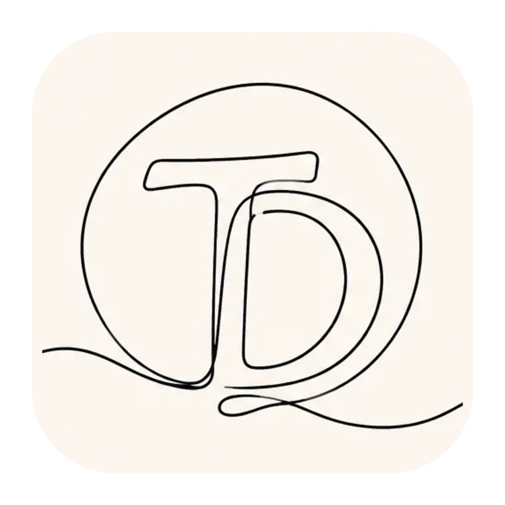

<p align="center">
  
</p>

<h1 align="center">True Drawing</h1>

<p align="center">
  <strong>IT</strong> - App desktop locale per trasformare uno schizzo disegnato dall'utente in un'immagine generata con AI.<br />
  <strong>EN</strong> - Local desktop app that turns a user-drawn sketch into an AI-generated image.
</p>

<p align="center">
  
  
  
  
  
</p>

## Scheda rapida / Quick facts

| IT | EN |
| --- | --- |
| Versione sorgente: `1.11.3` | Source version: `1.11.3` |
| Stato: C25 completata; release pubblicata `v1.11.0` | Status: C25 complete; published release `v1.11.0` |
| Piattaforme: macOS e Windows | Platforms: macOS and Windows |
| Runtime desktop: Electron | Desktop runtime: Electron |
| UI: React, TypeScript, Vite | UI: React, TypeScript, Vite |
| Canvas: HTML Canvas 2D con Pointer Events | Canvas: HTML Canvas 2D with Pointer Events |
| AI: OpenAI Images API configurata dall'utente | AI: user-configured OpenAI Images API |
| Segreti: Windows Credential Manager, macOS Keychain o fallback cifrato | Secrets: Windows Credential Manager, macOS Keychain, or encrypted fallback |
| Packaging: electron-builder, NSIS Windows, DMG/ZIP macOS | Packaging: electron-builder, Windows NSIS, macOS DMG/ZIP |
| Release: artifact GitHub non firmati | Releases: unsigned GitHub artifacts |
| Licenza dichiarata: Apache 2.0 | Declared license: Apache 2.0 |

## Riferimenti tecnici / Technical references

- Repository: `https://github.com/gloutchov/TrueDrawing`
- Sito / website: `https://truedrawing.glaucosilvestri.it/`
- App ID: `com.truedrawing.app`
- Package name: `truedrawing`
- Entry point Electron: `dist-electron/main/appMain.js`
- Configurazione app / app config: `config/app.config.json`
- Packaging config: `electron-builder.yml`
- Roadmap: `PLAN.md`
- Landing page: `docs/index.html`
- Architettura / architecture map: `MAP.md`
- Sicurezza / security model: `SECURITY_MODEL.md`
- Istruzioni utente IT: `ISTRUZIONI.md`
- User instructions EN: `INSTRUCTIONS.md`

## Comandi principali / Main commands

```bash
npm ci --no-audit --no-fund
npm run dev
npm run lint
npm run test
npm run build
npm run dist:win
npm run dist:mac
```

> IT: le build Windows/macOS pubblicate su GitHub non sono firmate perche' non sono disponibili certificati di firma o notarizzazione. Windows SmartScreen e macOS Gatekeeper possono mostrare avvisi al primo avvio.
>
> EN: Windows/macOS builds published on GitHub are unsigned because signing or notarization credentials are not available. Windows SmartScreen and macOS Gatekeeper may show warnings on first launch.

## Italiano

True Drawing e' un'app desktop locale per macOS e Windows pensata per disegnare con mouse, tavoletta grafica tipo Wacom o input compatibili con Pointer Events. L'obiettivo e' permettere all'utente di creare un disegno su canvas e generare una versione realistica tramite API configurata dall'utente.

Il progetto e' in fase iniziale. La versione sorgente `1.11.3` contiene lo skeleton desktop Electron/Vite/React, struttura modulare, configurazione centrale validata, canvas interattivo con Pointer Events e manina per navigare, strumenti di tratto/linea/shape/riempimento, layer, inspector realistico con generazione OpenAI, gestione API key tramite keychain/credential manager, preferenze modello/stile immagine e redraw automatico, preferenze lingua/tema interfaccia, hardening Electron con CSP, salvataggio manuale, autosave, recupero, export PNG/WebP, rifiniture UX con status bar, stati vuoti, conferme distruttive, zoom persistente, workflow manuale di release cross-platform, landing page statica bilingue sul dominio personalizzato, caricamento corretto degli asset renderer nei pacchetti installati e correzioni dei dialog impostazioni in tema scuro.

Repository pubblico GitHub: `https://github.com/gloutchov/TrueDrawing`.

### Distribuzione

Le release GitHub per Windows e macOS sono distribuite senza firma codice e senza notarizzazione perche' non sono disponibili certificati o credenziali di firma. Windows SmartScreen e macOS Gatekeeper possono quindi mostrare avvisi di sicurezza all'apertura dell'app scaricata.

La release cumulativa `v1.11.0` include Electron 44, React 19 e Lucide 1.48, oltre a brush avanzati, riferimenti, maschere/clipping, versioni documento e preset AI: `https://github.com/gloutchov/TrueDrawing/releases/tag/v1.11.0`. Il workflow manuale GitHub Actions `Release` valida documenti, versione, lint, test e build, poi genera artifact Windows/macOS non firmati, note release da `docs/release-notes/v1.11.0.md` e file checksum SHA-256.

### Landing page

La landing page pubblica e' disponibile esclusivamente all'indirizzo `https://truedrawing.glaucosilvestri.it/`. I file sorgente si trovano in `docs/index.html` e usano asset relativi da `docs/assets`. La pagina si apre direttamente nel browser senza backend, seleziona automaticamente italiano per browser/sistemi in italiano, inglese negli altri casi, e include nell'header un collegamento a `https://glaucosilvestri.it/`.

### Funzionalita'

- App desktop Electron avviabile con finestra principale True Drawing.
- Canvas pulito per disegno libero con input mouse, penna e touch compatibile.
- Strumenti per matita, pennarello, pennello e gomma.
- Sottomenù per linea retta/curva, shape rettangolo/ellisse/triangolo/poligono e tipo tratto continuo/tratteggiato/a puntini.
- Strumento riempimento delimitato dai confini gia' disegnati nel layer.
- Strumento selezione rettangolare per cut/copy/paste sul canvas, anche con `Ctrl/Cmd+X/C/V`.
- Oggetto incollato spostabile finche' resta selezionato.
- Controllo colore, dimensione tratto, opacita' e hardness.
- Zoom canvas con pulsanti `+`/`-`, reset e rotella del mouse.
- Manina come primo strumento a sinistra: trascinare il canvas per spostare la vista senza modificare il disegno; il reset zoom ricentra la vista.
- Dimensioni canvas modificabili in pixel o centimetri a DPI scelti, dal pannello destro e da `File > Impostazioni > Dimensioni canvas...`; lucchetto per mantenere le proporzioni e riquadri destri collassabili. Undo/redo ripristina la misura.
- Status bar con stato salvataggio, modifiche, tool, layer attivo, conteggio layer/tratti e zoom.
- Pulsante visibile per uscire dal fullscreen quando la finestra e' a schermo intero.
- Layer con creazione, rinomina, cancellazione protetta, visibilita', opacita' e riordino.
- Conferme per azioni rischiose come chiusura con modifiche non salvate, eliminazione layer, rimozione API key e scarto autosave.
- Undo e redo per tratti disegnati e operazioni layer.
- Inspector per generare e mostrare l'immagine realistica dal canvas, con stati chiari per immagine assente, generazione, errore e API key mancante.
- Menu per inserire, sostituire o rimuovere la API key OpenAI e scrivere il modello immagini.
- Menu per scegliere uno stile immagine predefinito o personalizzato.
- Menu per attivare redraw automatico dell'inspector dopo un tempo di inattivita' configurabile.
- Menu `File > Impostazioni > Interfaccia...` per scegliere lingua italiana/inglese e tema chiaro/scuro, con opzione default di sistema.
- Doppio click sull'inspector per passare fra immagine realistica e canvas.
- Autosave e salvataggio manuale di canvas e immagine.
- Salvataggio progetto `.tdraw`, sidecar `<nome>_canvas` e `<nome>_image`, recupero autosave ed export PNG/WebP.
- Gestione API key tramite Windows Credential Manager, macOS Keychain o fallback locale cifrato per ambienti non supportati.
- Modello immagini configurabile dall'utente come testo libero, con default OpenAI `gpt-image-1.5`.
- Stili immagine predefiniti in ordine alfabetico: acquerello, cartoon, infantile, olio, realistica, surreale.

### Documenti principali

- `PLAN.md`: piano milestone, versioni e verifiche.
- `AGENTS.md`: direttive operative per lo sviluppo.
- `STARTUP_PREFERENCES.md`: preferenze operative generali applicate alle nuove milestone.
- `MAP.md`: mappa ASCII della struttura del programma.
- `ISTRUZIONI.md`: istruzioni utente in italiano.
- `INSTRUCTIONS.md`: istruzioni utente in inglese.
- `SECURITY_MODEL.md`: modello di sicurezza in italiano e inglese.
- `config/app.config.json`: parametri modificabili da utenti skilled e sviluppatori.

### Sviluppo locale

Requisiti:

- Node.js 22.13 or newer (22.22 verified).13 o successivo (22.22 verificato).
- npm.

Comandi:

- `npm ci --no-audit --no-fund`
- `npm run dev`
- `npm run lint`
- `npm run test`
- `npm run build`
- `npm run dist:win`
- `npm run dist:mac`

## English

True Drawing is a local desktop app for macOS and Windows designed for drawing with a mouse, a graphics tablet such as Wacom, or input devices exposed through Pointer Events. The goal is to let users create a canvas drawing and generate a realistic image from it through a user-configured API.

The project is at its initial stage. Source version `1.11.3` includes the Electron/Vite/React desktop skeleton, modular structure, validated central configuration, interactive canvas with Pointer Events and a hand tool for navigation, stroke/line/shape/fill tools, layers, realistic inspector with OpenAI image generation, API key storage through keychain/credential manager, image model/style and auto-redraw preferences, interface language/theme preferences, Electron hardening with CSP, manual save, autosave, recovery, PNG/WebP export, UX polish with a status bar, empty states, destructive-action confirmations, persistent zoom, a manual cross-platform release workflow, a bilingual static landing page on the custom domain, correct renderer asset loading in installed packages, and dark-theme fixes for settings dialogs.

Public GitHub repository: `https://github.com/gloutchov/TrueDrawing`.

### Distribution

GitHub releases for Windows and macOS are distributed without code signing and without notarization because signing certificates or credentials are not available. Windows SmartScreen and macOS Gatekeeper may therefore show security warnings when opening the downloaded app.

Cumulative release `v1.11.0` includes Electron 44, React 19 and Lucide 1.48 alongside advanced brushes, references, masks/clipping, document versions and AI style presets: `https://github.com/gloutchov/TrueDrawing/releases/tag/v1.11.0`. The manual GitHub Actions `Release` workflow validates documents, version, lint, tests, and build, then creates unsigned Windows/macOS artifacts, release notes from `docs/release-notes/v1.11.0.md`, and SHA-256 checksum files.

### Landing Page

The public landing page is available exclusively at `https://truedrawing.glaucosilvestri.it/`. Its source lives at `docs/index.html` and uses relative assets from `docs/assets`. It opens directly in the browser without a backend, automatically selects Italian for Italian browser/system languages and English otherwise, and includes a header link to `https://glaucosilvestri.it/`.

### Features

- Runnable Electron desktop app with a True Drawing main window.
- Clean freehand drawing canvas with mouse, pen, and compatible touch input.
- Pencil, marker, brush, and eraser tools.
- Submenus for straight/curved line, rectangle/ellipse/triangle/polygon shape, and solid/dashed/dotted stroke style.
- Fill tool bounded by already drawn layer edges.
- Rectangular selection tool for canvas cut/copy/paste, including `Ctrl/Cmd+X/C/V`.
- Pasted object can be moved while it remains selected.
- Color, stroke size, opacity, and hardness controls.
- Canvas zoom with `+`/`-` buttons, reset, and mouse wheel.
- Hand as the first tool on the left: drag the canvas to move the view without changing the drawing; zoom reset recenters the view.
- Canvas size editable in pixels or centimeters at a chosen DPI, from the right panel and `File > Settings > Canvas size...`; aspect ratio lock and collapsible right panels. Undo/redo restores the size.
- Status bar with save state, dirty state, active tool, active layer, layer/stroke counts, and zoom.
- Visible fullscreen exit button while the window is fullscreen.
- Layer creation, renaming, protected deletion, visibility, opacity, and ordering.
- Confirmations for risky actions such as closing with unsaved changes, layer deletion, API key removal, and autosave discard.
- Undo and redo for drawn strokes and layer operations.
- Inspector for realistic image generation and preview from the canvas, with clear states for missing image, generation, errors, and missing API key.
- Menu entry to enter, replace, or remove the OpenAI API key and type the image model.
- Menu entry to choose a predefined or custom image style.
- Menu entry to enable inspector auto-redraw after a configurable idle delay.
- `File > Settings > Interface...` menu entry to choose Italian/English and light/dark theme, including system-default options.
- Double click on the inspector to switch between realistic image and drawing canvas.
- Autosave and manual save for both canvas and generated image.
- `.tdraw` project saving, `<name>_canvas` and `<name>_image` sidecars, autosave recovery, and PNG/WebP export.
- API key management through Windows Credential Manager, macOS Keychain, or encrypted local fallback for unsupported environments.
- User-configurable image model as free text, defaulting to OpenAI `gpt-image-1.5`.
- Predefined image styles in alphabetical order: acquerello, cartoon, infantile, olio, realistica, surreale.

### Main Documents

- `PLAN.md`: milestone plan, versions, and verification rules.
- `AGENTS.md`: development operating instructions.
- `STARTUP_PREFERENCES.md`: general operating preferences applied to new milestones.
- `MAP.md`: ASCII map of the program structure.
- `ISTRUZIONI.md`: user instructions in Italian.
- `INSTRUCTIONS.md`: user instructions in English.
- `SECURITY_MODEL.md`: security model in Italian and English.
- `config/app.config.json`: parameters editable by skilled users and developers.

### Local Development

Requirements:

- Node.js 22.
- npm.

Commands:

- `npm ci --no-audit --no-fund`
- `npm run dev`
- `npm run lint`
- `npm run test`
- `npm run build`
- `npm run dist:win`
- `npm run dist:mac`

C14 (`1.3.0`): limiti immagini, download remoti protetti, IPC e CSP rafforzati; messaggi safeStorage espliciti. / Image limits, protected remote downloads, stronger IPC/CSP and explicit safeStorage warnings.

## C15 - Brush avanzati e texture personalizzate (`1.4.0`)

Preset brush bilingui da configurazione: grafite, morbido, marker, inchiostro e texture; controlli pressione, velocita, spaziatura e texture procedurali. Parametri immutabili nei tratti e persistenti nei file tdraw. / Configurable bilingual brush presets, pressure/speed/spacing and procedural texture controls; per-stroke parameters persist in tdraw.

## C16 - Import immagini di riferimento (`1.5.0`)

Import locale PNG/JPEG/WebP da dialogo nativo controllato, normalizzazione PNG e limiti bytes/pixel. Riferimenti embedded separati con visibilita, opacita, posizione e scala: esclusi da export e AI. Caricamento immagini prima del rendering dopo riapertura. / Local dialog-controlled imports; embedded references with visibility, opacity, position and scale, excluded from exports and AI.

Patch `1.5.1`: WebP decodificato dal canvas Chromium dopo verifica RIFF/dimensioni nel main e normalizzato a PNG, perche nativeImage non supporta questo formato. / WebP is decoded by Chromium Canvas after RIFF/dimension checks in main and normalized to PNG, because nativeImage does not support this format. 87 test, lint/build e smoke import WebP chiaro/scuro.

## C17 - Maschere e clipping layer (`1.6.0`)

Maschere non distruttive con editor, attivazione e rimozione; clipping con identita layer stabili, controllo cicli e pulizia relazioni alla cancellazione. Rendering condiviso per canvas/export/AI, undo/redo e persistenza tdraw. / Non-destructive editable masks, stable layer clipping with cycle validation, shared rendering, undo/redo and persistence.

## C18 - Storia versioni del documento (`1.7.0`)

Snapshot persistenti manuali/automatici, consultazione, rinomina, ripristino e cancellazione; capsule senza ricorsione e limiti numero/byte da configurazione. Ripristino completo di canvas, layer, maschere, riferimenti e immagine AI; versioni conservate in tdraw e autosave, Undo ripristina lo stato precedente. / Persistent bounded document versions with complete restoration and non-recursive capsules.

## C19 - Preset di stile realistico (`1.8.0`)

Preset di stile bilingui con descrizioni, frammenti prompt e parametri OpenAI validati; preferito e stile personalizzato persistenti. Prompt privo di metadati progetto, guardia su credenziali accidentali e messaggi provider sanitizzati. / Configurable bilingual style presets, persistent favorite/custom styles and minimal generation payloads.

## C20 - Aggiornamento toolchain di sviluppo (`1.9.0`)

Toolchain aggiornata con Electron 44.4.5, Vite 8, Vitest 5 ed ESLint 10. TypeScript 6.0.3 e trattenuto sotto 6.1 per il supporto dichiarato di typescript-eslint; proposta TypeScript 7 rinviata. Config Vite ESM esplicita, compilazione Electron Node16/CommonJS, appunti PNG/testo asincroni con limiti e sanitizzazione senza cause private. / Updated toolchain with Electron 44.4.5, Vite 8, Vitest 5 and ESLint 10. TypeScript 6.0.3 stays below 6.1 within typescript-eslint support; TypeScript 7 is deferred. Explicit ESM Vite config, Node16/CommonJS Electron compilation and bounded asynchronous PNG/text clipboard with sanitized public errors.

## C21 - Migrazione React e React DOM (`1.10.0`)

React e React DOM allineati a 19.3.0 con tipi compatibili; componenti migrati al namespace JSX di React. La toolchain C20 resta preservata durante la risoluzione dei conflitti del lockfile; interazioni canvas, dialoghi e persistenza verificate nel renderer di produzione. / React and React DOM aligned at 19.3.0 with matching types; components use React-scoped JSX types. C20 toolchain preserved while resolving lockfile conflicts; canvas interactions, dialogs and persistence verified in the production renderer.

## C22 - Aggiornamento icone Lucide (`1.11.0`)

Lucide React aggiornato a 1.48.0 con React 19; export, toolbar, pannelli e icone SVG accessibili verificati nei temi chiaro/scuro. Migrazioni C20-C22 integrate preservando i commit Dependabot; release cumulativa Windows/macOS con pacchetti non firmati e verifica SHA-256 prevista nella chiusura. / Lucide React upgraded to 1.48.0 with React 19; exports, toolbars, panels and accessible SVG icons verified in light/dark themes. C20-C22 migrations preserve Dependabot commits; cumulative unsigned Windows/macOS release and SHA-256 verification complete the closing process.

## C23 - Spaziatura del pannello Riferimenti (`1.11.1`)

Importa riferimento allineato a destra; contenuto del pannello con padding 10/12 px e gap 8 px condivisi con Dimensioni canvas. Controlli e testo separati dai bordi. / Import reference aligned to the right; panel content uses the Canvas size padding (10/12 px) and 8 px gap. Controls and text have consistent space from panel edges.

## C24 - Spaziatura del pulsante Crea versione (`1.11.2`)

Crea versione allineato a destra come Applica, con margine superiore 8 px, inferiore 12 px e laterale 10 px. / Create version is aligned to the right like Apply, with 8 px above, 12 px below and 10 px beside the button.

## C25 - Rimozione dei comandi maschera (`1.11.3`)

Rimossi creazione, attivazione, modifica e rimozione maschere e il relativo instradamento dei tratti. Conservati clipping e compatibilita di rendering/persistenza delle maschere legacy, anche in snapshot; i normali tratti non modificano le maschere precedenti. / Mask creation, toggling, editing and removal commands and stroke routing are removed. Layer clipping and legacy mask rendering/persistence, including snapshots, remain compatible; normal drawing does not change legacy masks.
